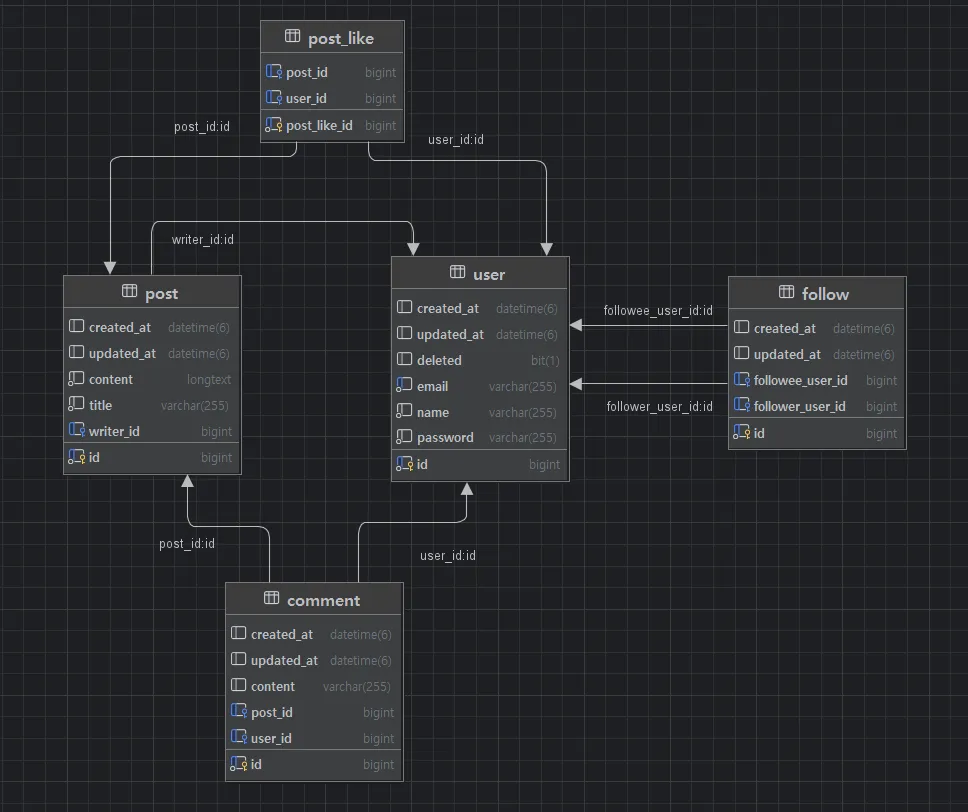

# NewsfeedProject

## 개발 프로세스

### 1. 프로젝트 설명
- 사용자가 사용자 인증, 게시글, 친구관리 기능이 있는 SNS 뉴스피드 프로젝트입니다.

### 2. 프로젝트 목적
- Spring 기반 웹 애플리케이션 개발 경험을 쌓는다.
- JWT 인증 방식 학습 및 구현한다.
- RESTful API 설계 및 문서화를 경험한다.
- 팀 협업을 통한 Git Workflow 및 코드 리뷰 습관을 형성한다.


## 팀 소개 & 팀원 역할

### 팀명
- **15조**

### 팀원 역할

| 이름 | 담당 기능 |
|------|-----------|
| 이다인 | 팔로우 기능, 친구 목록 조회 |
| 천세경 | 게시글 CRUD, 댓글 기능 |
| 최태웅 | 프로필 CRUD, 리펙토링 |
| 현동민 | 회원가입/로그인, 인증/인가(JWT) |

### 협업 방식
- **Git Flow 전략**을 적용하여 `dev` 브랜치에서 `feature/기능명` 브랜치 분기 후 병합
- **Pull Request**와 **코드 리뷰**를 통한 협업
- **Issue 관리**는 GitHub Issues + Projects 기능 활용
- **코드 컨벤션**: 팀 내 규칙 정리 및 Google Java Style 일부 준수
- **커밋 메시지 컨벤션**: 타입: 제목 - 상세내용(optional)


## 기능 설계

### 1. 와이어프레임
- [Figma 와이어프레임](https://www.figma.com/design/nKvAvkLYxViC8KpbjvKdO5/%EC%B5%9C%ED%83%9C%EC%9B%85-s-team-library?node-id=0-1&t=ECgMBDDsXmsjTubY-0)

### 2. ERD


### 3. API 명세서
- [API 명세서](https://www.notion.so/teamsparta/API-2002dc3ef5148025a1b5ffdebcade9ff)


## 기능 설명

### 1. 게시글 기능
- 게시글 작성, 수정, 삭제, 단일/전체 조회 구현
- 사용자별 작성 게시글 조회
- 타임라인 형식의 최신순 정렬 조회

### 2. 댓글 기능
- 게시글에 댓글 작성 및 삭제
- 대댓글 기능 미구현

### 3. 회원 기능
- 회원가입, 로그인 (JWT 발급)
- 인증된 사용자만 특정 API 접근 가능

### 4. 팔로우 기능
- 특정 유저 팔로우 및 언팔로우 기능
- 팔로잉, 팔로워 목록 조회
- 인증된 사용자 본인 기준 데이터 조회

## 트러블슈팅

<details>
  <summary>1. Filter 내 예외 처리 시 @RestControllerAdvice 미작동</summary>

  - `LoginFilter`에서 유효하지 않은 토큰을 검증 시, 아래와 같이 예외를 던졌지만:
  ```bash
  if (!jwtUtil.validateToken(token)) {
    throw new ResourceUnauthorizedException(ErrorCode.NOT_VALID_TOKEN);
   }
  ```
  - `@RestControllerAdvice`에서 처리되지 않고 500 에러가 발생했습니다.

  #### [원인 분석]
  - Spring의 Filter는 `DispatcherServlet`보다 먼저 실행되므로, Spring Context에서 관리하는 예외 처리기(`@RestControllerAdvice`)가 관여할 수 없습니다.
    - 즉, 필터에서 발생한 예외는 전역 예외 처리기로 전달되지 않아 기본 에러 응답(500)이 발생합니다.

  - **실패한 방법**
    - `response.sendError()` + `.yml` 설정 사용 → 에러 메시지는 전달되지만 `ApiResponse` 형식을 따르지 않아 해결하지 못했습니다.

#### [해결 방법]
- 직접 `HttpServletResponse`에 JSON 응답을 작성하는 방식으로 변경하였습니다.
- 다음과 같이 처리 메서드를 분리하여 응답을 구성하였습니다.
```java
public void jwtExceptionHandler(HttpServletResponse response, ErrorCode errorCode) {
    response.setStatus(errorCode.getStatus().value());
    response.setContentType("application/json");
    response.setCharacterEncoding("UTF-8");
    try {
        String json = new ObjectMapper().writeValueAsString(ApiResponse.failure(errorCode.getMsg()));
        response.getWriter().write(json);
    } catch (Exception e) {
        log.error(e.getMessage());
    }
}
```
- 그리고 검증 실패 시에는 throw 대신 해당 메서드를 호출하여 응답을 반환하였습니다.
```bash
if (!jwtUtil.validateToken(token)) {
    jwtExceptionHandler(httpResponse, ErrorCode.NOT_VALID_TOKEN);
    return;
}
```

#### [결과]
- 이제 필터에서도 ApiResponse 형식의 일관된 에러 메시지를 반환할 수 있게 되었으며,
  클라이언트는 모든 실패 응답을 통일된 포맷으로 받을 수 있도록 처리하였습니다.
</details>

## 후기
- 협업을 통해 Git, 코드 리뷰, API 문서화 등의 중요성을 체감했다.
- 역할 분담과 책임감을 갖고 진행한 덕분에 높은 완성도 유지할 수 있었다.